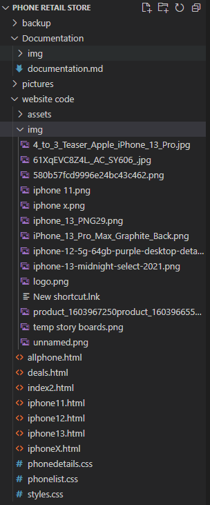
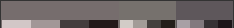
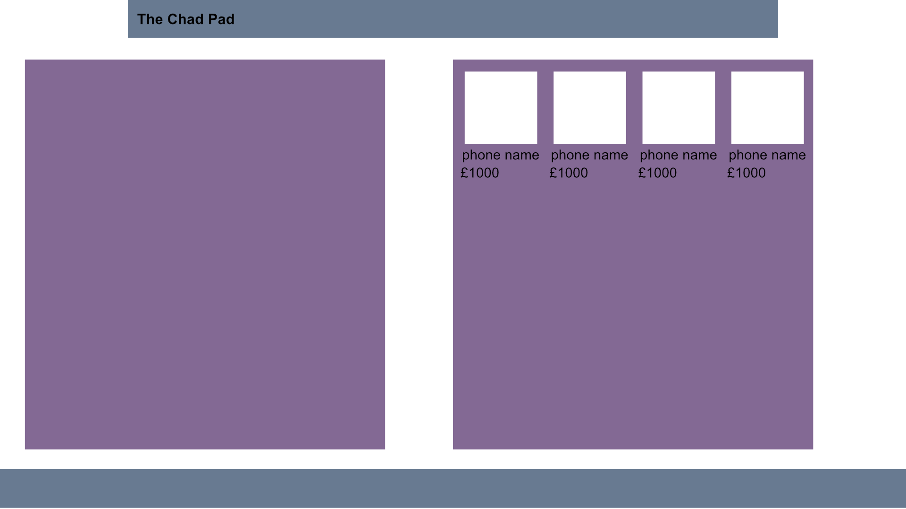
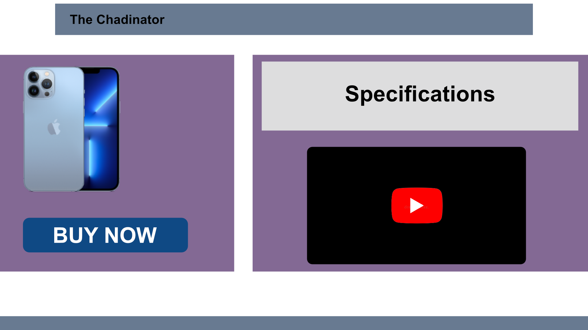
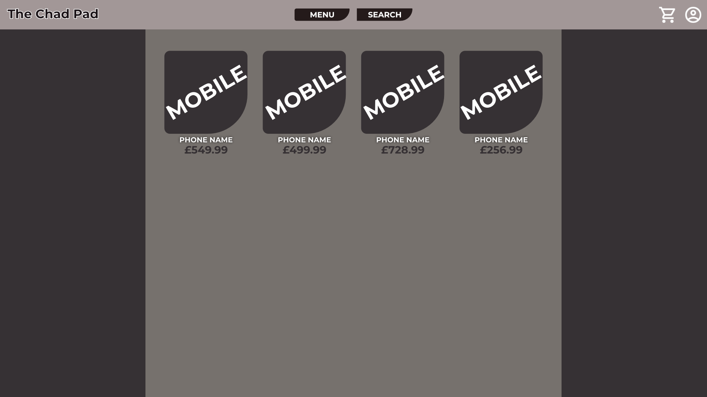
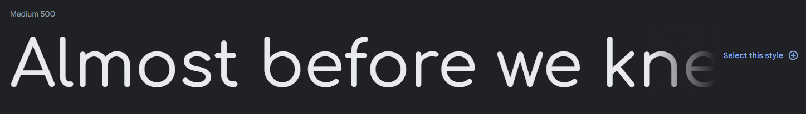
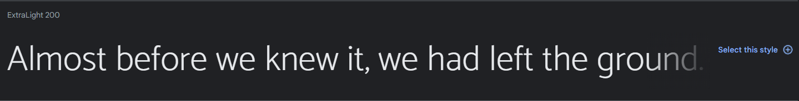
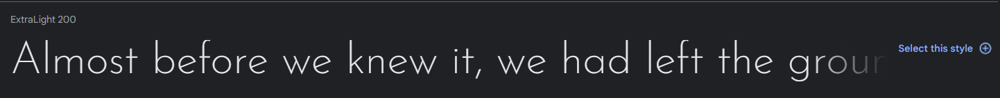
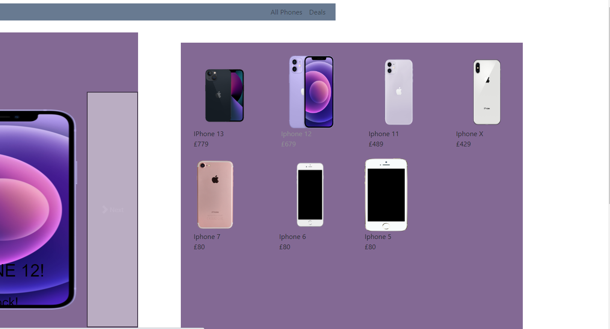

 # Stakeholders
## Customers
+ The website needs to have information on the product there selling in the case of a phone shop, the brand, model, camera resolusion
+ The needs to be easly accessible for everyone
+ The website needs to be easy to navigate and easy to find things
+ The Website needs to have an insial rendering of under 2 seconds
## Owners
+ The website needs to look good as this will repersent your brand
+ The website needs to look professional
+ The website needs to bring in business and money
+ The programmers need to be cheap because the owners dont want to pay more the they need
## Developers
+ The website must be well documented to be able to program it with the least amount of confusion
+ The website must be easy maintainable
+ The website must be easy to test to actually see if the website there making works
+ The Website meets the owners standards

# File Structure

# Website Requirements

+ My website should have a quick and responsive layout with a rendering under 2 seconds to keep the customers.
+ My website needs to have a video as 80% of online trafficing is video trafficing so the business would lose customers.
+ My website should have an easy to navigate layout and an clean website that isnt that over clustered.
+ My website should have easy fonts and colours to read and that dont blend into the backround. 

# Design of my Webssite

## Colour scheme

### Design 1
+ The colour scheme of the first design, ive gone for a pastel colour design as it complements the entire logo and i think it will complement the phones too as most phone companys allow you to get your phone in many different colours including the colours our scheme highlights such as blues and reds

+ The pastel pallet isn't too distracting and isn't too boring it the perfect as there quite soft colours

.colour-primary-1 {colour:687A91} = Header and footer colour

.colour-primary-2 {colour:836994} = Secondary colour

### Design 2
+ The colour scheme of the second design is a basic colours as the website is aimed at adults as children wont be buying these them selfs as the age that is the most of the percent of people to buy them is 30-50yr old women so i want it to look as professional as possible so they will be able to trust and understand the website.

## Final Colour Choice
+ I am going to use Design one as it suits the vibe of the indestry alot better then Design two, as well. Lisa stated that the grey would look kinda bland and boring, where as the blue and voilet looks better and has more flash to it which will keep the users interatction.

# Layout and Features

## Design 1

### Homepage 

+ The layout for the design will be very simple and easy to navigate, There will be a navigation bar at the top with a logo or text in the top left, On the right of the navigation bar there will be two fuctioning buttons titled "All Phones" and "Deals". 

+ There will be two boxes in the middle of the page with a seperation between them. The left box will have a carousel that will feature and promote the newest phones and best deals. On the right box there will be a small selection of phones. These will be the newest phones we have from apple and samsaung.

+ There will be a footer at the bottom of the page that will be the same colour as the header

### Phone Purchase Page

+ The layout for this page will be the same as the home page the only different will be that the box on the left will have an image in it, which will be the selected phone.

### Home Page

### Phone Specs Page

## Design 2 

### Homepage

+ The layout for the main page will be very easy to use and be able to tell what is for sale as all phones will be on the main page and there will be a sign in button on top left on the navigation bar, as well as a basket button being on the left allowing you to view what phones you have selected to buy

### Phone Purchase Page

+ The layout of this page will have a navigation bar which will be the same colour as the home page, There will be two boxes in the middle of the page with a seperation between the two

### Home Page

## Fonts
### Design 1: 
### Main fonts of the website
+ For the website i will use the Comfortaa font this is because it is a nice and simple font with not much change compaired to the normal font so it wont be as distracting, Comfortaa is also just quite an nice and smooth font to read in.     
+ The font will come from google fonts: https://fonts.google.com/specimen/Comfortaa,
The weight is gunna be: Medium 500.
+ My website will not all one font my second font of choice is Catamaran this is because i feel like it is a good contrast to my previous font, This will be used for all of the titiles and navigation bar. 
+ This font will come from google fonts: https://fonts.google.com/specimen/Catamaran, The weight of the font is gunna be: Extra-light 200. 

+ Comfortaa:

+ Catamaran:

### How i would use each font
I would use Catamaran for all the description and all the information as it is a good contrast to the other font as its quite sharp compaired to the smoothness of the Comfortaa and i would use the Comfortaa as titles and on the navigation bar as Comfortaa is designed for bigger text and it is quite a smooth and clean font.

## Design 2:

### Main fonts of the website 

+ For the website i will use the Josefin Sans font this is because it has quite a nice look to it and it is quite an unique font that i feel is under apprecated, it also goes really well with the layout and colours of this website.

+ The font will come from google fonts: https://fonts.google.com/specimen/Josefin+Sans, The weight of the font will be: Extra-light 200.

+ For the website i will also use the font Mukta it is quite a smooth look and slick looking font comparded to the hard edges of the Josefin Sans it is a nice contrast as i would use this font for the titles and navigation bar and then use the Josefin Sans font for the use of information and descriptions of them. 

+ Josefin Sans:

# Final Design Choice - Design 1 

I have chosen design 1 due to it feeling more interactive, design 2 feels very unvarying compared to the carousel that design 1 has. The colour scheme as well doesnt seem as boring and feels like it suits the indestry alot more, Aiden stated that: "It looks very gloomy and unprofesional and doesnt give the store feeling". Design 1 also doesnt feel as crouded compared to the list on design 2. 

# Asset list

 | Assets         | Origin                                                 |
|----------------|--------------------------------------------------------|
| carousel       | https://getbootstrap.com/docs/4.0/components/carousel/ |
| IPhone13 image | https://www.apple.com/uk/shop/buy-iphone/iphone-13     |
| IPhone12 image | https://www.apple.com/uk/shop/buy-iphone/iphone-12     |
| IPhone11 image | https://www.apple.com/uk/shop/buy-iphone/iphone-11     |
| IphoneX Image  | https://mydukaan.io/album12/products/iphone-x          |
|                |                                                        |

# Navigation

+ if you are able to travel there it will have an "Y"
+ If you might be ablr to travel there it will have an "m"

| Column - FROM Row - TO | home | All Phones | Deals | Iphone X | Iphone 11 | Iphone 12 | Iphone 13 |
|------------------------|------|------------|-------|----------|-----------|-----------|-----------|
| home                   | Y    | Y          | Y     | Y        | Y         | Y         | Y         |
| All Phones             | Y    | Y          | Y     | Y        | Y         | Y         | Y         |
| Deals                  | Y    | Y          | Y     | Y        | Y         | Y         | Y         |
| Iphone X               | Y    | Y          | Y     | Y        |           |           |           |
| IPhone 11              | Y    | Y          | Y     |          | Y         |           |           |
| Iphone 12              | Y    | Y          | Y     |          |           | Y         |           |
| Iphone 13              | Y    | Y          | Y     |          |           |           | Y         |

# Tests

| Spell Checked Website                                                    | Spell Checked Nothing spelt Wrong                |
|--------------------------------------------------------------------------|--------------------------------------------------|
| Confirm all links lead to intended place according to the navigation map | All links and buttons are working as they should |
| Confirm all images render properly                                       | All images render correctly                      |
| Confirm all css is working                                               | css is working                                   |
| Carousel Left and Right buttons are working correctly                    | They are working as intended                     |
| Carousel Images are rendering correctly                                  | The Carousel images have rendered correctly      |
| All Navigation bar buttons are working as intended                       | All working Perfectly                            |

I also needed to test if the websites assets and proportions would work as intended on two different web browers i used firefox and google chrome.

+ Google Chrome

+ Firefox:

# Reviews
## Aiden : 
The colour choice is nice, the purple with the contrast of white is nice with it being accented around.

The font colour and choice could be improved, I'd recommend the colour white would fit and a different font to look better.

The phone website looks good, at the time of writing this - there is no video. The specs are great, wide variety to look at and compare others with. The buy button is missing too. Why may i not purchase thy product.

### Response:

I have change the colours on the purple so there more readable however i couldnt find a colour that looks good on the blue other then black. Now whenever you hover a phone the font colour will change making it easier to read

## Ash :
it looks very nice because you have good boxes with loads of improtant information
i like the name
the colour purple on the website makes it look depressing
you might need to work on the links a bit
the text colour looks nice
theres a lot of detail in the text boxes, a bit to much for my brain to handle
very nice selection of phones,not a single andriod hmm

### Response: 
I couldnt find another colour that goes with the blue at all and i think the purple and blue looks quite perfeshional, I have toned down the text boxes alot and made it only the inportant stuff

# Final Website

The final product is really close to the original plan of the website. There had to be some design changes like how phones where ameant to have a box around each of them, However in the final product i felt like it was much more pleasing and much more appealing to not have them sorrounded by a box.

Another thing that i had to change in the final product is the fact there was a video on each phonepage which wouldnt really work very well as the size of the video was making the video unwatchable and not clear when it came to writing or numbers. So i scrapped the idea, and was going to make new box or switch round the phone image and the video allowing it more watchable

# Development Revision And Feedback

In the making of the website some the proportions had to be ajusted and changed meaning some of the proportions may not be the same as the plan

+ The first amount of feedback i have been given was that the font colour could be better i feel like if i would have made this white it would have popped alot more then it currently does.

+ The next amount of feedback i got was that i should add videos of unboxing and spec explination so you what your buying

# Stengths and weaknesses

The website isnt the best when it comes to different resolutions then 1920x1080 as the full website cant be seen and you have to scroll left to right, up and down to be able to view the full website. However it has some serious strengths like when you zoom in on information it is easily readable and it doesnt stretch or go out of proportions so people with poor vision can easy read the details of the phones.

 
