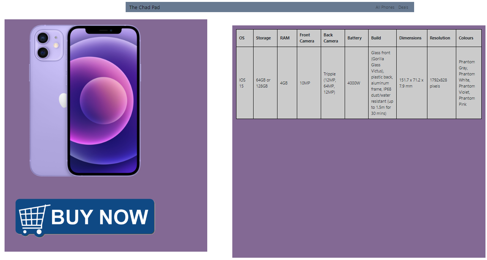

 # Stakeholders
## Customers
+ The website needs to have information on the product their selling in the case of a phone shop, the brand, model, camera resolution
+ The needs to be easily accessible for everyone
+ The website needs to be easy to navigate and easy to find things
+ The Website needs to have an initial rendering of under 2 seconds
## Owners
+ The website needs to look good as this will represent your brand
+ The website needs to look professional
+ The website needs to bring in business and money
+ The programmers need to be cheap because the owners dont want to pay more the they need
## Developers
+ The website must be well documented to be able to program it with the least amount of confusion
+ The website must be easy maintainable
+ The website must be easy to test to actually see if the website they're making works
+ The Website meets the owners standards

# File Structure

# Website Requirements

+ My website should have a quick and responsive layout with a rendering under 2 seconds to keep the customers.
+ My website needs to have a video as 80% of online trafficking is video trafficking so the business would lose customers.
+ My website should have an easy to navigate layout and an clean website that isnt that over clustered.
+ My website should have easy fonts and colours to read and that dont blend into the backround. 

# Design of my Webssite

## Colour scheme

### Design 1
+ The colour scheme of the first design, i've gone for a pastel colour design as it complements the entire logo and I think it will complement the phones too as most phone companys allow you to get your phone in many different colours including the colours our scheme highlights such as blues and reds

+ The pastel pallet isn't too distracting and isn't too boring it the perfect mix of the two as they're quite soft colours

.colour-primary-1 {colour:687A91} = Header and footer colour

.colour-primary-2 {colour:836994} = Secondary colour

### Design 2
+ The colour scheme of the second design is a basic colours as the website is aimed at adults, children wont be buying these themselves.  The biggest percentage of people to buy them is 30-50yr old women, I want it to look as professional as possible so they will be able to trust and understand the website.

## Final Colour Choice
+ I am going to use Design one as it suits the vibe of the industry a lot better then Design two, as well. Lisa stated that the grey would look bland and boring, where as the blue and violet looks better and has more flash to it which will keep the users interaction.

# Layout and Features

## Design 1

### Homepage 

+ The layout for the design will be very simple and easy to navigate, There will be a navigation bar at the top with a logo or text in the top left, On the right of the navigation bar there will be two fuctioning buttons titled "All Phones" and "Deals". 

+ There will be two boxes in the middle of the page with a seperation between them. The left box will have a carousel that will feature and promote the newest phones and best deals. On the right box there will be a small selection of phones. These will be the newest phones we have from apple and samsaung.

+ There will be a footer at the bottom of the page that will be the same colour as the header

### Phone Purchase Page

+ The layout for this page will be the same as the home page the only different will be that the box on the left will have an image in it, which will be the selected phone.

### Home Page

### Phone Specs Page

## Design 2 

### Homepage

+ The layout for the main page will be very easy to use and be able to tell what is for sale as all phones will be on the main page and there will be a sign in button on top left on the navigation bar, as well as a basket button being on the left allowing you to view what phones you have selected to buy

### Phone Purchase Page

+ The layout of this page will have a navigation bar which will be the same colour as the homepage, There will be two boxes in the middle of the page with a seperation between the two

### Home Page

## Fonts
### Design 1: 
### Main fonts of the website
+ For the website I will use the Comfortaa font this is because it is a nice and simple font with not much change compaired to the normal font so it wont be as distracting, Comfortaa is also just quite an nice and smooth font to read in.     
+ The font will come from google fonts: https://fonts.google.com/specimen/Comfortaa,
The weight is going to be: Medium 500.
+ My website will not be all in one font my second font of choice is Catamaran this is because i feel like it is a good contrast to my previous font, This will be used for all of the titles and navigation bar. 
+ This font will come from google fonts: https://fonts.google.com/specimen/Catamaran, The weight of the font is going to be: Extra-light 200. 

+ Comfortaa:

+ Catamaran:

### How i would use each font
I would use Catamaran for all the description and all the information as it is a good contrast to the other font as its quite sharp compaired to the smoothness of the Comfortaa and I would use the Comfortaa as titles and on the navigation bar as Comfortaa is designed for bigger text and it is quite a smooth and clean font.

## Design 2:

### Main fonts of the website 

+ For the website I will use the Josefin Sans font this is because it has a nice look to it and it is quite an unique font that I feel is under appreciated, it also goes really well with the layout and colours of this website.

+ The font will come from google fonts: https://fonts.google.com/specimen/Josefin+Sans, The weight of the font will be: Extra-light 200.

+ For the website I will also use the font Mukta it is a smooth look and slick looking font comparded to the hard edges of the Josefin Sans it is a nice contrast as I would use this font for the titles and navigation bar and then use the Josefin Sans font for the use of information and descriptions of them. 

+ Josefin Sans:

# Final Design Choice - Design 1 

I have chosen design 1 due to it feeling more interactive, design 2 feels very unvarying compared to the carousel that design 1 has. The colour scheme as well doesn't seem as boring and feels like it suits the indestry alot more, Aiden stated that: "It looks very gloomy and unprofesional and doesnt give the store feeling". Design 1 also doesnt feel as crouded compared to the list on design 2. 

# Asset list

 | Assets         | Origin                                                 |
|----------------|--------------------------------------------------------|
| carousel       | https://getbootstrap.com/docs/4.0/components/carousel/ |
| IPhone13 image | https://www.apple.com/uk/shop/buy-iphone/iphone-13     |
| IPhone12 image | https://www.apple.com/uk/shop/buy-iphone/iphone-12     |
| IPhone11 image | https://www.apple.com/uk/shop/buy-iphone/iphone-11     |
| IphoneX Image  | https://mydukaan.io/album12/products/iphone-x          |
|                |                                                        |

# Navigation

+ if you are able to travel there it will have an "Y"
+ If you might be ablr to travel there it will have an "m"

| Column - FROM Row - TO | home | All Phones | Deals | Iphone X | Iphone 11 | Iphone 12 | Iphone 13 |
|------------------------|------|------------|-------|----------|-----------|-----------|-----------|
| home                   | Y    | Y          | Y     | Y        | Y         | Y         | Y         |
| All Phones             | Y    | Y          | Y     | Y        | Y         | Y         | Y         |
| Deals                  | Y    | Y          | Y     | Y        | Y         | Y         | Y         |
| Iphone X               | Y    | Y          | Y     | Y        |           |           |           |
| IPhone 11              | Y    | Y          | Y     |          | Y         |           |           |
| Iphone 12              | Y    | Y          | Y     |          |           | Y         |           |
| Iphone 13              | Y    | Y          | Y     |          |           |           | Y         |

# Tests

| Test                                                                     | Result                                                           |
|--------------------------------------------------------------------------|------------------------------------------------------------------|
| Confirm all links lead to intended place according to the navigation map | All links lead to the correct place                              |
| Confirm all images render properly under 2 seconds                       | All images render under 2 seconds properly                       |
| Confirm the CSS for my header works as intended                          | My CSS for my header is working as intended                      |
| Confirm the CSS for my footer works as intended                          | My CSS for my footer is working as intended                      |
| Confirm the CSS for my flex boxes are working as intended                | My CSS for my flex boxes are working as intended                 |
| Confirm the CSS for my image sizes and movements are working as intended | My CSS for my images sizes and movements are working as intended |
| Confirm all images are actually being found and being loaded             | All images are being found and loaded                            |

I also needed to test if the websites assets and proportions would work as intended on two different web browers I used Firefox and Google Chrome.

+ Google Chrome

+ Firefox:

# Reviews
## Aiden : 
The colour choice is nice, the purple with the contrast of white is nice with it being accented around.

The font colour and choice could be improved, I'd recommend the colour white would fit and a different font to look better.

The phone website looks good, at the time of writing this - there is no video. The specs are great, wide variety to look at and compare others with. The buy button is missing too. Why may I not purchase thy product.

### Response:

I have change the colours on the purple so there more readable however I couldnt find a colour that looks good on the blue other then black. Now whenever you hover over a phone the font colour will change making it easier to read

## Ash :
it looks very nice because you have good boxes with loads of important information
I like the name
the colour purple on the website makes it look depressing
you might need to work on the links a bit
the text colour looks nice
theres a lot of detail in the text boxes, a bit to much for my brain to handle
very nice selection of phones,not a single android hmm

### Response: 
I couldnt find another colour that goes with the blue at all and I think the purple and blue looks quite professional, I have toned down the text boxes a lot and made it only the inportant stuff

# Final Website

The final product is really close to the original plan of the website. There had to be some design changes like how phones were mean't to have a box around each of them. However, in the final product I felt like it was much more pleasing and much more appealing to not have them sorrounded by a box.

Another thing that I had to change in the final product is the fact there was a video on each phone page which wouldnt really work very well as the size of the video was making the video unwatchable and not clear when it came to writing or numbers. So I scrapped the idea, and was going to make new box or switch round the phone image and the video allowing it more watchable.

Also, using the feed back from my peers, I had to change a couple things from the original design, such as in Aiden's feedback he states that "The fonts are hard to read". To fix this problem I made it so when hovering over text under a phone or the image of the phone the text changes to white allowing to be easily read.   

I have also changed the font choice from the original design

This website is fit for purpose and meets the requirements of the stakesholders. The customers have a clear and easy to under demostration of what brand and what specs each phone has, as well the rendering time is under 2 seconds keeping user interactions. The navigation isn't hard to understand and its easy to navigate to each phone purchase page. When it comes to the owners the website looks professional and most likely will bring in business and money as it has the newest and best iPhone. The programmer needed for this website would be quite cheap as the code is rather simply, meaning its also very maintainable. Developers would be able to maintain this website quite easy, all the code is in order of what it will appear in on the screen, also the website is easily tested. This website would meet the owners standards.

Another thing I would need to do is complete the code for "All Phones" and "Deals".

Three things that I would improve:

+ One thing I would improve is the font styles and colours, The font is one of the complaints from my feed back along side the colour of the font.
+ Another thing that I would improve is adding videos along side the specs of the phones.
+ Last thing I would improve on is making the navigation bar slightly bigger so its not as cramped

 
